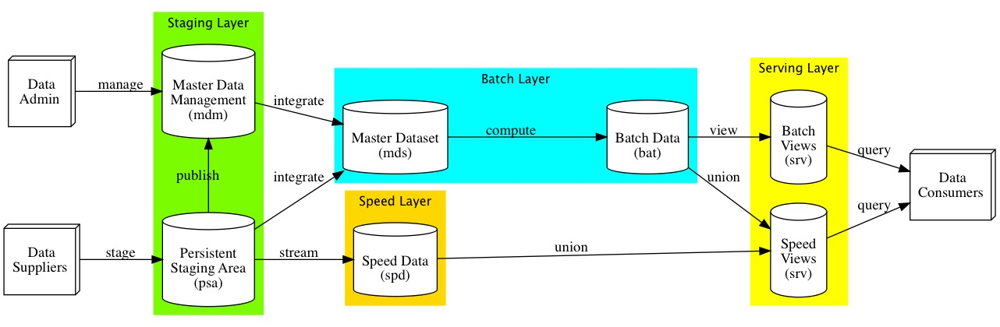
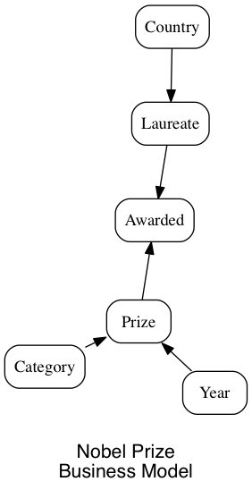
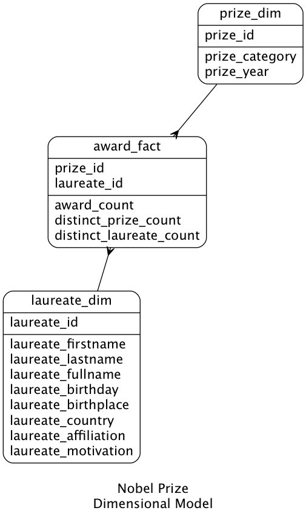
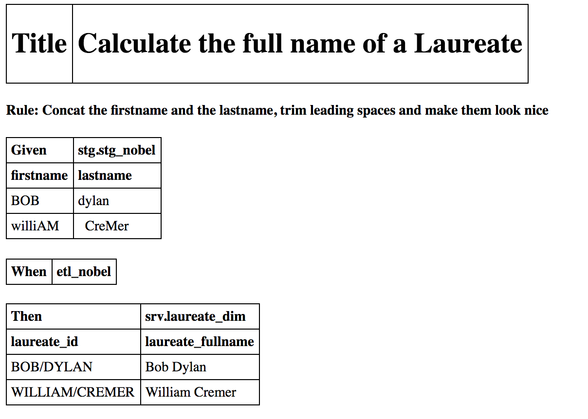
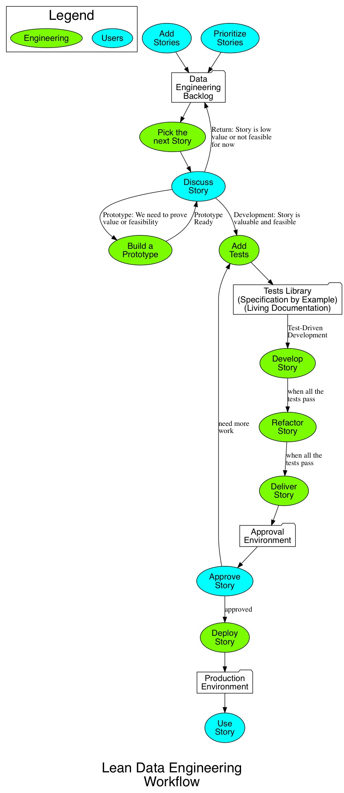

# Lean Data Engineering
#### 01/02/2017

### Eliminating waste by documenting just enough and coding more

[Youtube](https://www.youtube.com/watch?v=AUcpkMVdikc)

Through all the years developing data engineering systems, I have created many types of artifacts to design and document the delivered software … with very variable levels of usefulness and success.

If you do Agile and/or Lean BI, many well-known documents just do not work. When real-life happens, Gantt Charts get obsolete in a matter of hours. Source-to-Target spreadsheets face the same fate. They don’t work well for documenting complex transformations. In fact, they can’t keep up with the real code at all.

The primary goal of any documentation is to become a communication tool between the architects, the end-users, and the developers. To meet this goal and to keep the documentation up to date, you have to make it an integrated part of the development workflow.

The deliverables for a data engineering software are:

A **Data Flow Diagram (DFD)** showing your main data repositories and flows. It is often based on a well-defined pattern like the Lambda Architecture. This diagram support communication with the different groups involved in setting up servers, databases, distributed file systems, data pipelines and tools. Below is a context/top level DFD of your solution. You are free to explode it into sub-diagrams if it is useful. Be careful to not go too far with the details.

A **Business Model** showing the main data entities and their relationships. Remember, you want to keep this at the end-user level so you can use it for communication. You don’t need to show the attributes to drive very useful discussions about the business.

If you start adding attributes to your business model, it will evolve into a **Dimensional Model**. This is still just a communication tool rather than a physical model. End-users prefer to discuss over dimensional models. They shouldn’t be concerned by the final physical format of their data. For example, you can deliver the data physically “flat” in a columnar database. Usually, physical dimensions will also include some temporal attributes so you can track history (record effective time, record expiration time, etc). They usually don’t add much to the diagram when used as a discussion tool.

As much as you try to avoid it, you still need some transformations documentation. A good way of doing it is to do **test-driven ETL development**. To do so, you create real life tests that are executed by your test framework. The tests become your documentation and they are also directly executed without re-coding. Those tend to stay up to date overtime and add a lot of robustness and stability to your ETL application. They also support you when refactoring your existing application. You can change the existing process and assure that you still deliver the same output. I usually build my test framework using Python. You don’t need a source-to-target mapping document since your tests become the living documentation. The tests can’t get obsolete because they are driving the development. I usually use a mix of Gherkin (Given, When and Then) and Table format to write the tests.

If your development gathers momentum, you may see the benefits of creating a **kanban workflow**. You can fill the backlog with data stories describing the attributes needed for your BI solution. You will then work with your end-users to rank some stories by value and feasibility. You don’t need to rank the full backlog, just enough stories to get the development rolling. A well-defined development workflow will help team members stay focused, efficient, and waste conscious. A development workflow will also promote prototyping as a way to turn obscure requirements into automated tests.

Finally, the most important deliverable is **working software!** Without this nothing else is important. The process and data delivered must make a positive impact to the business.

For extra credits, an important part of being lean is to create an **automation tool**. Your ETL processes, your DBA tasks, and your deployments can be driven by your metadata. The code, tables or tasks you derive are always efficient and robust. They are also easy to update after changing the metadata. Your automation tool acts as a [poka-yoke](https://en.wikipedia.org/wiki/Poka-yoke) against human errors. It also free your time for more important work. Personally, I use Python or dynamic SQL to build my automation tools.
