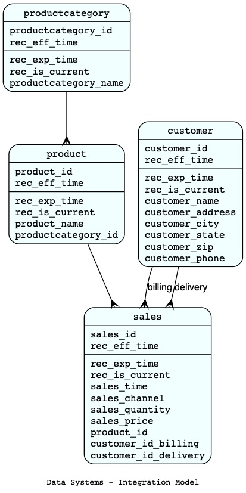
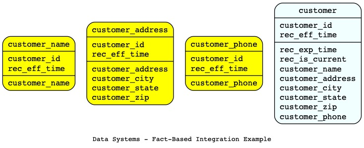
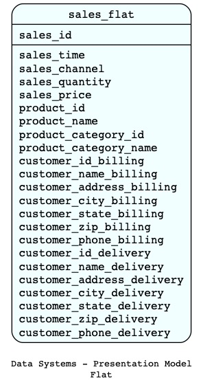
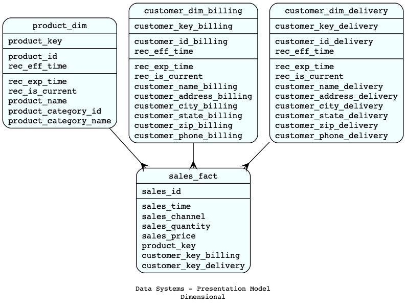

# Data Systems - Modeling
#### 02/15/2018

The final curated files we build for the data consumers are often flat and served in a columnar file format like parquet or a columnar database like Amazon Redshift. But before getting there you often have to build more advanced data integration processes and files. 

The Curation process takes care of two things:

* Data Integration
* Data Presentation

For a simple curation process you can skip the creation of integrated files and directly build the final presentation files. But as transformation rules gets more complex or data sources multiplies, you will have a need for adding a data integration step.

### Data Integration

The Data Integration process do not care about how you want to present the data. It cares about getting the data in one common model from which you can produce multiple presentation files without re-computing complex transformations.

The output of the data integration process is a normalized temporal model:

For Data Warehousing people, the return of normalization may feel strange. The thing here is that we don't assume what the data consumers need, especially the grain they will ask for. The integrated model gives you the freedom to present the data in many different ways and at many different grains without re-normalizing the data.

The integration files represent the value of the attributes at different times. Each natural key is also stamped with a "record effective time". Together they form the temporal primary key. This temporal format could be enough for many Big Data scenarios. If you can afford the processing time, you can simplify the future querying by adding a "record expiration time" and a "record is current" attribute. You can also add a "record is deleted" attribute to handle logical deletes (not shown).

We are not using surrogate keys anywhere in our integration model. We use natural keys. Using natural keys gives us the possibility to compute all the files in parallel (and faster) without any dependencies or lookups. We also use roleplaying foreign keys. They will have a suffix added to the foreign key attribute (Ex: billing and delivery).

In a very complex data integration scenario, it may be useful to first build a few fact-based temporal datasets of each attributes and then merge their timelines.

In this example, each customer attribute gets its history processed independently. Closely related attributes can be processed together, like the address, city, state and zip. Then, the three attribute files (in yellow) are merged together (in blue), creating one row for each distinct rec_eff_time present in any of the files. At this point you get a dataset with all the customer attributes but some values are missing (Null) if the timelines are different across attributes. You then use back fill and forward fill logics to fill the missing history. See the detailed example: [missing history](https://stefdeblois.github.io/how-to-fill-the-missing-history/).

### Data Presentation

The Data Presentation process compute final files ready to be served to our data consumers. We customize the presentation files to every need, at the right grain with just the needed attributes. They must be fully computed from the integration files without any complex transformations.

The presentation model is often flat, columnar, customized, aggregated and served to query engines and BI tools.

In our example, if we fully denormalized, the flat file would look like this:

To get an accurate point-in-time representation, the integrated files are denormalized from top to bottom. First, an integrated parent is rolled into and integrated child by using the child rec_eff_time. The process is repeated until we are left with one flat dataset, the presentation file.

When I mention “rolled into”, I mean we compute a new file because this is an immutable processing world. Roleplaying attributes are also getting tagged with their suffixes along the way (billing or delivery).

To make the presentation process sustainable, accurate and fast, it is important to automate. This data modeling technique make it possible to do so. I previously built "denormalizers" in SQL Server, Python, Pandas and Spark with great success. I did so by directly using the integrated files and without managing any manual metadata. 

You can also, for example, generate all your data models by reverse-engineering the files into a Graphviz script.

Some data serving technologies, especially if they are not columnar, prefers a dimensional model (star schema). You still need to denormalize from parent to child but you stop when you have two layers of data: the dimensions and the fact table. The dimensional model will often be use for regular scale datasets as they usually require the use of surrogate keys to support querying ... and surrogate keys are expensive to create at large scale.

### Conclusion

By separating integration concerns from presentation concerns you are creating a very powerful "data pump" that can compute new presentation datasets quickly (without repeating transformations) and at very different level of aggregation customized to different consumers. You can also customized the presentation datasets to the consumers and to the tools they use without impacting the integration process.
