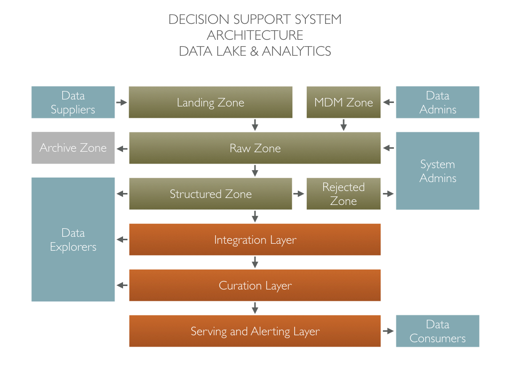
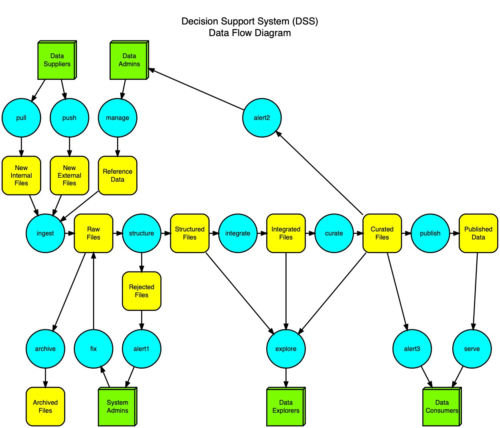

# Data Systems - Roles, Data, Processes
#### 05/22/2019

A Data System contains multiple roles, repositories and processes working together to transform your raw data into information and then serve it to the business. It is usually used in the context of very large data volumes (Big Data) but its principles can be successfully applied to regular size analytics systems where immutability and re-computation provide the same benefits around simplicity and efficiency.

A generic DSS architecture includes a raw data processing engine, often called "Data Lake" or "Persistent Staging Area". It is composed of different zones that receive raw data, store raw data and make it structured and usable for analytics. The architecture also include analytics layers that transform the data into information and serve it to the data consumers. 

Many roles, repositories and processes work together in an integrated data flow. Let's explore this ... 

#### Push/Pull

 A Data Supplier **push** files to the new files repository. The new files are stored in a "landing" zone to isolate them from your internal data until ingestion. The landing process can also **pull** new files from a data supplier's API .

#### Ingest

 The ingestion process move the new files to the permanent raw zone. The raw files are immutable and can be use to recompute all the downstream repositories. No transformation is happening during the ingestion. Files are stored "as-is", typically in their original JSON, CSV or ZIP format. Often, the files are stored in a temporal folder structure, for example {SupplierName}/{SourceName}/YYYY/MM/DD/{filename.json}. This folder structure help managing our files if needed (overwriting or removing bad files, identifying missing files, identifying new folders, etc).

#### Structure

The structure process find the new raw files and structure them to make them usable by the integration process. This is where you do "expensive" transformations like unzipping, parsing json, etc. The content itself is not transformed and remains raw. Often, the structured files will be one-to-one with the ingested files but sometimes you would, for example, package a day of ingested files into one structured file. The storage format is usually columnar like, for example, parquet files. 

The structure process is usually incremental because the unzipping and parsing is expensive and the data is raw and usually stable. But, even if the structure process is incremental, you must be able to delete all or some of the structured files and get them automatically rebuilt if needed. We also use the structure process to add some metadata fields to each row. For example: source file name and push/pull time.

If a file can't be structured it is move to the rejected files repository (see section "Fix").

#### Integrate

The integration process read the structured files and compute integrated datasets that will be use by the curation process. It is at this point that we discuss a business model for our information and build all the required transformations and integration steps to load the business model. The integrated files are similar to what is known as a "data warehouse". They are typically normalized (with history) and stored in a columnar file format like parquet files. Contrary to classic data warehousing, the integrated files are abandoned at the end of the load process. They are just a stepping stone toward your final curated datasets. The integrated files are immutable and fully recomputed every time. It is not recommended to run this process incrementally because of the added complexity in coding and management.

#### Curate

The curation process read the integrated files and compute curated queryable datasets that will be served to the data consumers. It is at this point that we discuss the type of queries we need to support. The curated files are similar to what is known as "data marts". They are typically stored in a flat columnar file format like parquet. The curated files are immutable and fully recomputed every time. Again, it is not recommended to run this process incrementally because of the added complexity in coding and management.

#### Publish/Serve

The serve process present curated information to the data consumers. Usually the curated information is served through query engines and reporting tools. It can also send business alerts based on business rules defined by the data consumers. Also, if unexpected results are presented, the serve process can send system alerts to the system administrators. A data consumer can also be another external system that use the curated information for its own processing. Some query engines, like Amazon Redshift, can be put on top of the curated files and connect directly to the curated parquet files using Spectrum. Some other query engines may need the curated files to be replicated as SQL tables inside the engine.

#### Alert Type 1

If the structure process reject some files an alert type 1 is sent. The alert type 1 will initiate a review/fix process by the system administrators.

#### Alert Type 2

If the integration and curation process is missing some reference data and alert type 2 is sent. The alert type 2 will tell the data administrators that some reference data is missing or need to be completed.

#### Alert Type 3

Alerts type 3 are business oriented messages that let some data consumers know that pre-defined business conditions have been met. It could be, for example, when some threshold of sales are reached or when non-regular business activities are detected.

#### Manage

The manage process use a user interface to let the data administrators update the ingested data by adding, for example, lookup values, code descriptions, etc. It is basically where you create and manage the data that have no source. This process often start by storing CSV files in the ingestion repository. Later, the process move to real UIs when things gets more complex. This process will also offer ways to handle system alerts sent by the serve process (like missing lookup value alerts, etc).

#### Fix

The fix process let the system administrators investigate rejected files, fix them and move them back to the ingestion repository so they can get structured. As much as we dream of automation, the thousand ways a file can be bad will most likely force this process to be manual. Any automation of this process tend to be "discovered" as you go instead of being planned.

#### Explore

The explore process is a very popular subject those days. It includes advanced data analysis activities like data profiling, artificial intelligence, machine learning, data science, etc. Those activities are often based on training algorithms using real-data, generating results using new data and evaluating the value and feasibility of using those results in your day-to-day operations. When your exploration results are valuable and feasible, the data team add those algorithms and calculations into the regular process and the curated datasets.

#### Archive

After a system has been running for a while, the raw zone may contains files that are becoming obsolete or very unlikely to be needed again. Because the master repository is usually based on a dynamic storage technology like S3, it can get expensive to keep everything there. In that case you can archive files to a more permanent storage technology like, for example, Glacier.
