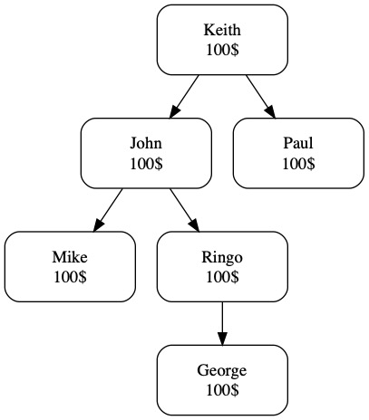
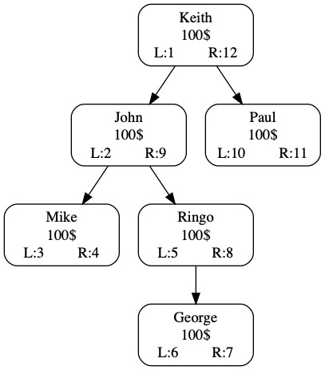

# How to aggregate a variable-depth hierarchy
#### 11/06/2019

Let's say you have a variable-depth employee hierarchy in a sales organization. In our example below, each employee sold 100$ of product. How would you aggregate the sales of each employee and their subordinates?



One way of doing this is to assign a left key (L) and a right key (R) to each employee by crawling through the hierarchy.



Now, it is easy to summarize the sales of any employee. For example, John's sales is the sum of every member with a L key between 2 and 9 ... that include himself. John's total sales is 400$. 

### As an example, we can build this process in PySpark ...

First, let's build our example in a Dataframe

```python
# setup the hierarchy
print("we are starting with a sales hierarchy")
mydata = [("K1","Keith",100,None),("P1","Paul",100,"K1"),
          ("J1","John",100,"K1"),("M1","Mike",100,"J1"),
          ("R1","Ringo",100,"J1"),("G1","Georges",100,"R1")]
myschema = ["emp_id","emp_name","emp_sales","boss_id"]
df_employees = spark.createDataFrame(mydata,schema=myschema)
df_employees.show()

```

    we are starting with a sales hierarchy
    +------+--------+---------+-------+
    |emp_id|emp_name|emp_sales|boss_id|
    +------+--------+---------+-------+
    |    K1|   Keith|      100|   null|
    |    P1|    Paul|      100|     K1|
    |    J1|    John|      100|     K1|
    |    M1|    Mike|      100|     J1|
    |    R1|   Ringo|      100|     J1|
    |    G1| Georges|      100|     R1|
    +------+--------+---------+-------+
    

Then, build the recursive function for the calculation. It crawls through the hierarchy and assign the left and right keys.

```python
from pyspark.sql.types import *
from pyspark.sql import functions as fn

# -----------------------
# LR Method functions
# -----------------------

# recursive LR function
def lr_method_recursive(hierarchy_df,parent_id,child_id,curr_id,curr_key):
    curr_key = curr_key + 1
    
    hierarchy_df = hierarchy_df \
    .withColumn("l_key",fn.when(fn.col(child_id) == curr_id,fn.lit(curr_key)).otherwise(fn.col("l_key")))
    
    child_list = hierarchy_df.filter(parent_id + " = '" + curr_id + "'").collect()
    if len(child_list) > 0:
        for x in child_list:
            hierarchy_df,curr_key = lr_method_recursive(hierarchy_df,parent_id,child_id,x[child_id],curr_key)
    curr_key = curr_key + 1
    
    hierarchy_df = hierarchy_df \
    .withColumn("r_key",fn.when(fn.col(child_id) == curr_id,fn.lit(curr_key)).otherwise(fn.col("r_key")))
    
    return hierarchy_df,curr_key
  
# starting the LR process
def lr_method(hierarchy_df,parent_id,child_id):
    # initiate the LR keys
    hierarchy_df = hierarchy_df.withColumn("l_key",fn.lit(None).cast(IntegerType()))
    hierarchy_df = hierarchy_df.withColumn("r_key",fn.lit(None).cast(IntegerType()))
    # find the top of the hierarchy
    curr_id = hierarchy_df.filter(parent_id + " is null").select(child_id).collect()[0][0]
    # start the recursive process
    hierarchy_df,curr_key = lr_method_recursive(hierarchy_df,parent_id,child_id,curr_id,0)
    return hierarchy_df

```

Finally, execute the LR function to assign all the L and R keys

```python
# execute the LR calculation
print("we are adding the LR keys through the hierarchy")
df_employees_lr = lr_method(df_employees,"boss_id","emp_id")
df_employees_lr.show()
```

    we are adding the LR keys through the hierarchy
    +------+--------+---------+-------+-----+-----+
    |emp_id|emp_name|emp_sales|boss_id|l_key|r_key|
    +------+--------+---------+-------+-----+-----+
    |    K1|   Keith|      100|   null|    1|   12|
    |    P1|    Paul|      100|     K1|    2|    3|
    |    J1|    John|      100|     K1|    4|   11|
    |    M1|    Mike|      100|     J1|    5|    6|
    |    R1|   Ringo|      100|     J1|    7|   10|
    |    G1| Georges|      100|     R1|    8|    9|
    +------+--------+---------+-------+-----+-----+
    

... and now, it is easy to aggregate to sales of each employee using a simple SQL query

```python
# aggregate the sales
print("we query the hierarchy and aggregate the sales")
df_employees_lr.createOrReplaceTempView("df_employees_lr")
df_sales = sqlContext.sql("""
select t1.emp_id,t1.emp_name,sum(t2.emp_sales) total_sales
  from df_employees_lr t1
  join df_employees_lr t2 on t2.l_key >= t1.l_key and t2.l_key <= t1.r_key
  group by t1.emp_id,t1.emp_name
""")
df_sales.show()
```

    we query the hierarchy and aggregate the sales
    +------+--------+-----------+
    |emp_id|emp_name|total_sales|
    +------+--------+-----------+
    |    P1|    Paul|        100|
    |    R1|   Ringo|        200|
    |    K1|   Keith|        600|
    |    G1| Georges|        100|
    |    M1|    Mike|        100|
    |    J1|    John|        400|
    +------+--------+-----------+
    
